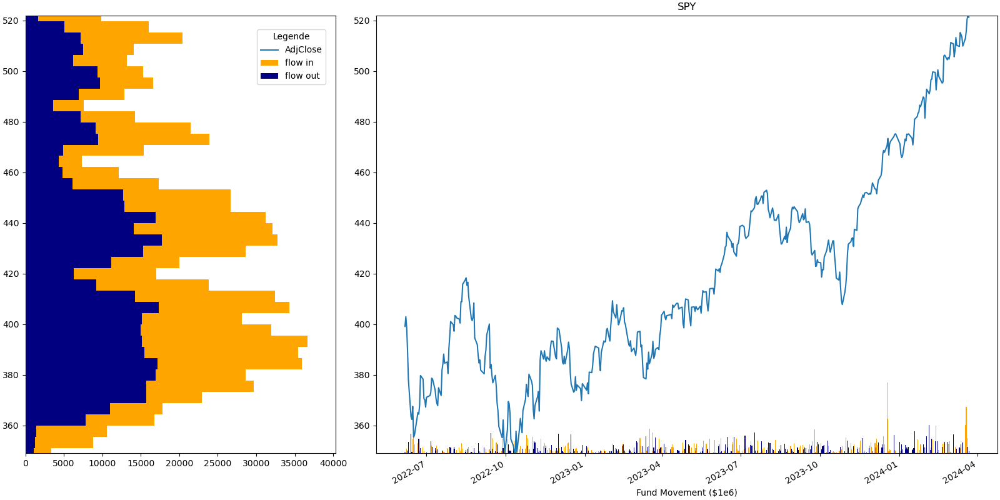

# ETF Fund Flows

This python programm overlays historic price data with flow data from etf.com.

## Create conda environment
```bash
conda env create -f environment.yml

conda activate etfflow
```

## How to run?

```bash
conda activate etfflow
cd src
python3 fund_flows.py
```

## Some Results


