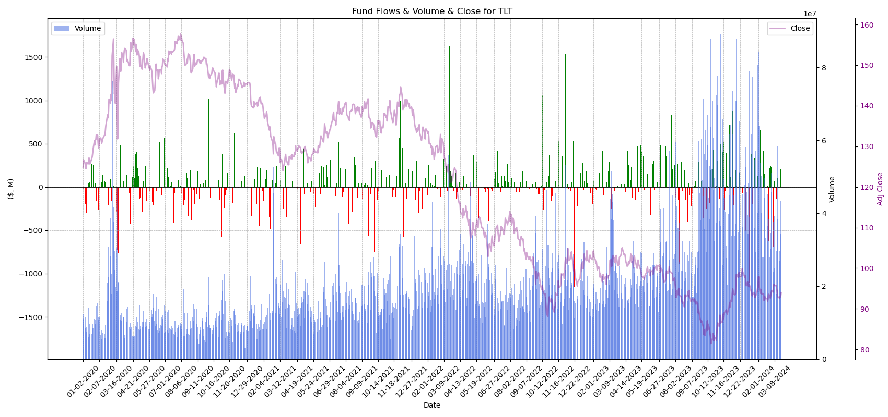

# ETF Fund Flows

This python programm overlays historic price data with flow data from etf.com.

## python Package

Required packages:
- python=3.11
- numpy=1.26.3
- pandas=2.2.0
- scipy=1.12.0
- ta=0.11.0
- yfinance=0.2.36 (conda install -c ranaroussi yfinance)
- matplotlib=3.8.1

## Create conda environment
```bash
conda env create -f environment.yml

conda activate etfflow
```

## How to run?

```bash
conda activate etfflow

python3 fund_flows.py
```

## Some Results


